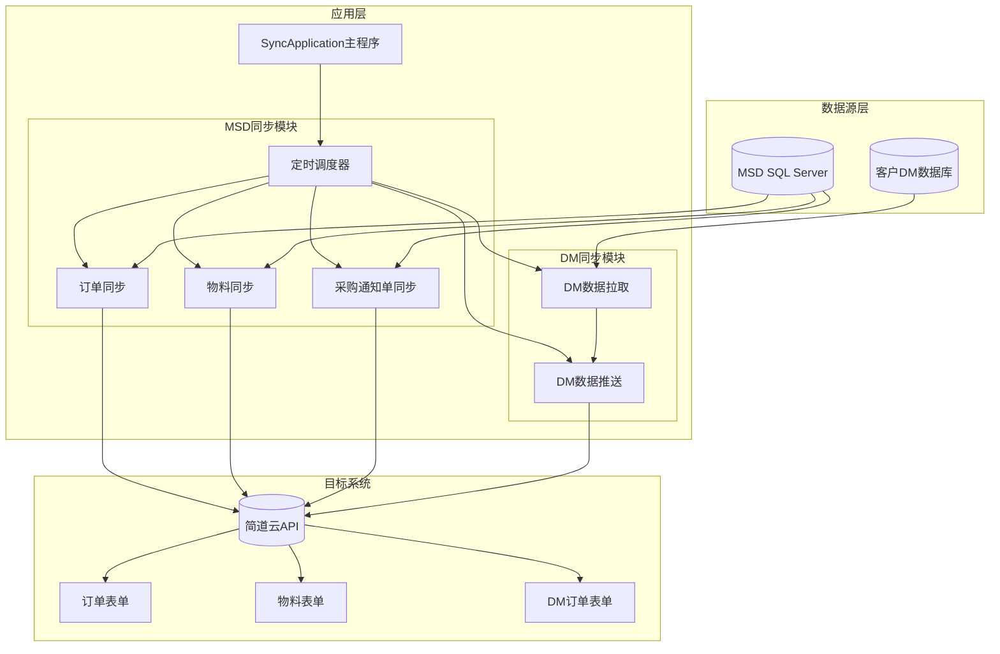

# 简道云数据同步程序 V2.0

## 项目概述

简道云数据同步程序是一个基于Java开发的企业级多数据源同步解决方案，支持将本地SQL Server数据库中的订单、物料、采购通知单数据以及客户DM数据库中的数据增量同步到简道云表单系统。

### 核心特性

- **多数据源支持**: 支持MSD数据库和客户DM数据库的双向同步
- **增量数据同步**: 基于时间戳和ID的智能增量同步机制
- **定时任务调度**: 每5分钟自动执行同步任务
- **字段映射配置**: JSON配置文件灵活配置数据库字段与简道云字段映射
- **错误重试机制**: 内置重试机制，最大重试10次
- **批量处理**: 支持批量创建和更新数据，提高同步效率
- **智能去重**: 自动检测并处理重复数据
- **自定义码生成**: 为特定状态订单生成唯一编码

## 系统架构

### 整体架构图



### 技术栈

- **Java 8**: 主要开发语言
- **Maven**: 项目构建和依赖管理
- **SQL Server**: 数据源数据库
- **简道云API**: 目标数据存储平台
- **HikariCP**: 高性能数据库连接池
- **Jackson**: JSON数据处理

## 功能模块详解

### 1. MSD数据同步模块

#### 订单同步 (`OrderSyncService`)
- **数据源**: `oms_order` 表
- **目标表单**: 简道云订单表单
- **特色功能**:
  - 自定义码生成（A-Y,0-9序列，排除I、O、Z）
  - 智能去重处理
  - 批量数据上传
  - 状态判断和更新

#### 物料同步 (`ItemSyncService`)
- **数据源**: `oms_job_item_info` 表
- **目标表单**: 简道云物料表单
- **特色功能**:
  - 精确物料匹配（工单号+物料号双重匹配）
  - 产品信息智能提取
  - VID、PID自动识别

#### 采购物料通知单同步 (`DeliveryNoticeSyncService`)
- **数据源**: `po_delivery_notice` 表
- **目标表单**: 简道云采购通知单表单
- **特色功能**:
  - 主子表同步支持
  - 子表数据自动关联
  - 复杂字段映射处理

### 2. DM数据同步模块

#### DM数据拉取 (`DmDataPullService`)
- **数据源**: 客户DM数据库（虚拟机）
- **目标**: 本地数据库 `dm_order` 表
- **特色功能**:
  - 增量同步（基于 `modify_time` 字段）
  - 双数据库连接池管理
  - 状态标记机制（C=创建，U=更新）
  - 批量数据拉取

#### DM数据推送 (`DmJdySyncService`)
- **数据源**: 本地数据库 `dm_order` 表
- **目标表单**: 简道云DM订单表单
- **特色功能**:
  - 智能操作判断（无需查询简道云）
  - ID缓存机制（`jdy_data_id`字段）
  - 批量处理优化
  - 错误重试和状态跟踪

## 核心配置

### 数据库配置

#### 本地数据库 (`db.properties`)
```properties
db.url=jdbc:sqlserver://127.0.0.1:1433;databaseName=LC_EDI;trustServerCertificate=true
db.username=sa
db.password=your_password
db.poolSize=10
db.minIdle=5
db.idleTimeout=300000
db.connectionTimeout=20000
db.maxLifetime=1200000
```

#### DM数据库 (`dm_db.properties`)
```properties
dm.db.url=jdbc:sqlserver://dm-server:1433;databaseName=DM_DB;trustServerCertificate=true
dm.db.username=dm_user
dm.db.password=dm_password
dm.db.poolSize=5
```

### 简道云API配置 (`application.properties`)
```properties
# 简道云API配置
jdy.apiUrl=https://api.jiandaoyun.com/api/v5/app/entry/data/batch_create
jdy.queryUrl=https://api.jiandaoyun.com/api/v5/app/entry/data/list
jdy.updateUrl=https://api.jiandaoyun.com/api/v5/app/entry/data/update
jdy.appId=your_app_id
jdy.entryId=your_entry_id
jdy.apiToken=Bearer your_api_token
jdy.isStartWorkflow=true

# 同步配置
sync.maxRetry=10
sync.retryInterval=5000
sync.maxBatchSize=50

# DM同步配置
dm.jdy.appId=your_dm_app_id
dm.jdy.entryId=your_dm_entry_id
dm.sync.enabled=true
```

### 字段映射配置

| 配置文件 | 用途 | 示例 |
|---------|------|------|
| `field_mapping.json` | MSD订单字段映射 | `"job_num": "_widget_1742010071756"` |
| `item_field_mapping.json` | MSD物料字段映射 | `"item_number": "_widget_xxx"` |
| `dm_field_mapping.json` | DM数据库字段映射 | `"order_no": "order_no"` |
| `dm_to_jdy_field_mapping.json` | DM到简道云字段映射 | `"order_no": "_widget_1770078767290"` |

## 数据库表结构

### 核心表结构

#### 同步状态表 (`sync_status`)
```sql
CREATE TABLE sync_status (
    id INT PRIMARY KEY,
    last_sync_id INT,              -- 最后同步ID
    sync_date DATE,                -- 同步日期
    sync_count INT,                -- 同步计数
    last_sync_time DATETIME2(7)    -- DM同步时间戳
);
```

#### DM订单主表 (`dm_order`)
```sql
CREATE TABLE dm_order (
    id INT IDENTITY(1,1) PRIMARY KEY,
    source_id INT UNIQUE,          -- 源系统ID
    order_no NVARCHAR(100) UNIQUE, -- 订单号
    -- 业务字段...
    sync_status INT DEFAULT 0,     -- 同步状态
    sync_operation CHAR(1),        -- 操作类型(C/U)
    jdy_data_id NVARCHAR(100),     -- 简道云数据ID
    sync_attempts INT DEFAULT 0,   -- 重试次数
    sync_error NVARCHAR(MAX),      -- 错误信息
    created_time DATETIME2 DEFAULT GETDATE(),
    updated_time DATETIME2 DEFAULT GETDATE()
);
```

## 快速开始

### 环境要求

- Java 8或更高版本
- Maven 3.6或更高版本
- SQL Server数据库
- 简道云账号和API权限

### 安装部署

1. **克隆项目**
```bash
git clone <repository-url>
cd LC_API_Code_V2.0
```

2. **配置数据库连接**
编辑 `db.properties` 和 `dm_db.properties` 文件

3. **配置简道云API**
编辑 `application.properties` 文件

4. **编译项目**
```bash
mvn clean package -DskipTests
```

5. **运行程序**
```bash
java -jar target/api_sql-1.0-SNAPSHOT-jar-with-dependencies.jar
```

## 启动模式

程序支持多种启动模式：

```bash
# 默认模式：定时同步所有数据
java -jar api_sql-1.0-SNAPSHOT-jar-with-dependencies.jar

# 单次同步模式
java -jar api_sql-1.0-SNAPSHOT-jar-with-dependencies.jar order      # 只同步订单
java -jar api_sql-1.0-SNAPSHOT-jar-with-dependencies.jar item       # 只同步物料
java -jar api_sql-1.0-SNAPSHOT-jar-with-dependencies.jar delivery   # 只同步采购通知单
java -jar api_sql-1.0-SNAPSHOT-jar-with-dependencies.jar dm         # 只拉取DM数据
java -jar api_sql-1.0-SNAPSHOT-jar-with-dependencies.jar dmpush     # 只推送DM到简道云
```

## 核心算法

### 1. 增量同步算法

#### MSD增量同步
```java
// 基于ID的增量同步
Integer lastSyncId = getLastSyncId();
List<Map<String, Object>> newData = fetchNewData(lastSyncId);
```

#### DM增量同步
```java
// 基于时间的增量同步
LocalDateTime lastSyncTime = localDao.getLastSyncTime();
List<DmOrder> remoteOrders = remoteDao.fetchIncrementalOrders(lastSyncTime, batchSize);
```

### 2. 智能操作判断

#### DM数据推送优化
```java
// 通过sync_operation字段直接判断操作类型
if ("C".equals(order.getSyncOperation())) {
    createOrders.add(order);
} else if ("U".equals(order.getSyncOperation())) {
    updateOrders.add(order);
}
```

### 3. 自定义码生成算法

```java
private static final char[] CUSTOM_CODE_CHARS = "ABCDEFGHJKLMNPQRSTUVWXY0123456789".toCharArray();

public String getCustomCode(LocalDate currentDate, int lastCount) {
    // A-Y + 0-9 序列，排除 I、O、Z
    // 生成规则：前缀 + 日期 + 序号
}
```

## 错误处理与监控

### 错误处理机制

1. **重试机制**: 最大重试10次，间隔5秒
2. **错误记录**: 失败记录保存错误信息到数据库
3. **状态跟踪**: 同步状态实时更新
4. **优雅关闭**: 支持程序优雅关闭，确保任务完成

### 监控指标

- ✅ 同步数据量统计
- ✅ 成功/失败记录统计
- ✅ 同步耗时监控
- ✅ 错误重试次数统计
- ✅ 数据库连接状态
- ✅ API调用成功率

### 日志级别

程序使用Java Util Logging：
- **INFO**: 正常操作日志
- **WARNING**: 警告信息
- **ERROR**: 错误信息

## 故障排除

### 常见问题

#### 1. 数据库连接失败
**症状**: 启动时报连接错误
**解决**:
- 检查数据库服务是否启动
- 验证连接配置是否正确
- 检查网络连接和防火墙

#### 2. 简道云API调用失败
**症状**: API返回401/403错误
**解决**:
- 验证API Token是否有效
- 检查应用ID和表单ID是否正确
- 查看简道云API配额限制

#### 3. 字段映射错误
**症状**: 数据同步成功但字段值为空
**解决**:
- 检查JSON配置文件格式
- 验证字段名拼写是否正确
- 检查数据类型匹配

#### 4. DM同步无数据
**症状**: DM拉取显示"无新数据"
**解决**:
- 检查 `last_sync_time` 是否正确
- 验证DM数据库连接配置
- 确认DM数据库中有新数据

### 调试模式

启用调试日志：
```properties
# 在 application.properties 中设置
logging.level.org.example=DEBUG
```

## 性能优化

### 1. 连接池优化
- 使用HikariCP连接池
- 合理配置连接池参数
- 独立管理多个数据库连接

### 2. 批量处理
- 批量数据操作减少API调用
- 合理设置批次大小（默认50条）
- 支持大批量数据同步

### 3. 增量同步
- 基于时间戳和ID的智能增量
- 避免全量数据扫描
- 减少网络传输和数据库压力

## 开发指南

### 项目结构
```
src/main/java/org/example/
├── config/          # 配置管理
├── dao/            # 数据访问层
├── dm/             # DM同步模块
│   ├── config/     # DM配置管理
│   ├── dao/        # DM数据访问
│   ├── model/      # DM数据模型
│   └── service/    # DM业务服务
├── model/          # 数据模型
├── service/        # 业务服务层
│   └── impl/       # 服务实现
└── util/           # 工具类
```

### 添加新同步类型

1. **创建Service接口** 继承 `SyncService`
2. **实现Service类** 在 `service/impl/` 目录下
3. **添加启动逻辑** 在 `SyncApplication.main()` 中
4. **创建字段映射** 添加对应的JSON配置文件
5. **更新数据库** 创建必要的表结构

### 代码规范

- ✅ 使用单例模式管理服务类
- ✅ 统一的异常处理和日志记录
- ✅ 配置文件外部化管理
- ✅ 数据库操作使用连接池
- ✅ API调用添加重试机制

## 版本历史

### V2.0 (当前版本)
- ✅ 新增DM数据同步模块
- ✅ 支持多数据源同步
- ✅ 优化增量同步算法
- ✅ 改进错误处理机制
- ✅ 增强配置管理功能

### V1.0
- ✅ 基础MSD数据同步功能
- ✅ 订单、物料、采购通知单同步
- ✅ 定时任务调度
- ✅ 字段映射配置
- ✅ 基础错误处理

## 技术支持

如有问题请联系：
- **技术支持邮箱**: support@example.com
- **项目文档**: [项目Wiki地址]
- **问题反馈**: [Issue跟踪系统]

---

**最后更新**: 2026-02-04  
**文档版本**: V2.0  
**作者**: 简道云数据同步项目组