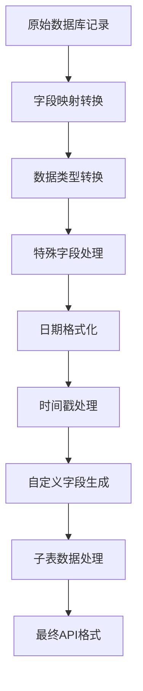

# 数据转换和字段映射文档

## 概述

本文档详细说明简道云数据同步程序中的数据转换逻辑和字段映射关系，包括转换规则、映射配置、特殊字段处理和数据格式化方法。系统负责将SQL Server数据库中的原始数据转换为符合简道云API要求的格式。

## 数据转换架构

### 转换流程图


### 核心组件
- **DataTransformService**: 数据转换服务主类
- **FieldMappingConfig**: 字段映射配置管理
- **字段映射文件**: JSON格式的映射配置

## 字段映射配置

### 1. 订单字段映射（field_mapping.json）

#### 主表字段映射结构
```json
{
  "main_fields": {
    "数据库字段名": "简道云字段ID"
  },
  "sub_tables": {
    "子表名": {
      "数据库字段名": "简道云字段ID"
    }
  }
}
```

#### 核心字段映射示例
| 数据库字段 | 简道云字段ID | 字段说明 |
|------------|--------------|----------|
| sid | _widget_1742010071749 | 系统标识 |
| order_number | _widget_1742010071750 | 订单号 |
| job_num | _widget_1742010071756 | 工单号 |
| job_status | _widget_1742010071758 | 工单状态 |
| item_number | _widget_1742010071777 | 物料号 |
| customer_code | _widget_1742010071778 | 客户代码 |
| work_required_date | _widget_1742010071786 | 工作要求日期 |
| factory_product_instructions | _widget_1748997819978 | 工厂产品说明 |

### 2. 物料字段映射（item_field_mapping.json）

#### 物料信息字段映射示例
| 数据库字段 | 简道云字段ID | 字段说明 |
|------------|--------------|----------|
| job_num | _widget_1747712590417 | 工单号 |
| item_number | _widget_1747712590419 | 物料号 |
| product_name | _widget_1747712590423 | 产品名称 |
| product_category | _widget_1747712590429 | 产品类别 |
| item_capacity | _widget_1747712590425 | 物料容量 |

### 3. 子表映射配置

#### 物料需求清单（requireComponentList）
```json
"requireComponentList": {
  "require_item_number": "_widget_1742269557590",
  "requirement_quantity": "_widget_1742269557596",
  "work_procedure": "_widget_1742269557591",
  "uom": "_widget_1742269557592",
  "yield_rate": "_widget_1742269557595"
}
```

#### 测试流程方案（testProcessSchemeList）
```json
"testProcessSchemeList": {
  "test_item_number": "_widget_1742269557609"
}
```

#### 晶圆DC信息（waferDcList）
```json
"waferDcList": {
  "component_item_id": "_widget_1742269557612",
  "lot": "_widget_1742269557613",
  "dc": "_widget_1742269557614",
  "wafer_id": "_widget_1742269557615",
  "qty": "_widget_1742355416612"
}
```

## 数据转换规则

### 1. 基础字段转换

#### 标准转换格式
所有字段都转换为简道云API要求的格式：
```java
// 转换示例
String destField = fieldMapping.get(srcField);
Object value = record.get(srcField);
converted.put(destField, Collections.singletonMap("value", 
    value == null ? "" : value.toString().trim()));
```

#### 空值处理
- null值转换为空字符串
- 字符串值去除前后空格
- 保持数据一致性

### 2. 日期字段转换

#### 支持的日期字段
```java
List<String> dateFields = Arrays.asList(
    "work_required_date",    // 工作要求日期
    "pmc_reply_date",        // PMC回复日期
    "work_start_date",       // 工作开始日期
    "work_end_date",         // 工作结束日期
    "plan_finish_date",      // 计划完成日期
    "factory_delivery_date"  // 工厂交付日期
);
```

#### 日期格式转换逻辑
```java
// 支持多种日期类型转换
if (dateValue instanceof LocalDate) {
    formattedDate = ((LocalDate) dateValue).format(DATE_FORMATTER);
} else if (dateValue instanceof LocalDateTime) {
    formattedDate = ((LocalDateTime) dateValue).format(DATE_FORMATTER);
} else if (dateValue instanceof java.sql.Date) {
    formattedDate = ((java.sql.Date) dateValue).toLocalDate().format(DATE_FORMATTER);
} else if (dateValue instanceof java.sql.Timestamp) {
    formattedDate = ((java.sql.Timestamp) dateValue).toLocalDateTime().format(DATE_FORMATTER);
}
```

#### 字符串日期解析
```java
// 处理字符串格式日期
if (((String) dateValue).contains(":")) {
    // 带时间的完整格式
    formattedDate = LocalDateTime.parse(
        ((String) dateValue).replace(" ", "T"),
        DateTimeFormatter.ofPattern("yyyy-MM-dd'T'HH:mm:ss[.SSSSSSS]"))
        .format(DATE_FORMATTER);
} else {
    // 纯日期格式
    formattedDate = LocalDate.parse((String) dateValue).format(DATE_FORMATTER);
}
```

### 3. 时间戳字段转换

#### 时间戳字段列表
```java
List<String> timestampFields = Arrays.asList(
    "job_last_update_date",  // 工单最后更新时间
    "po_last_update_date"    // 采购单最后更新时间
);
```

#### 复杂时间格式处理
```java
// 处理 "MM dd yyyy h:mma" 格式 (例如: "03 29 2025 3:53PM")
if (strValue.matches("\\d{2}\\s+\\d{2}\\s+\\d{4}\\s+\\d{1,2}:\\d{2}(AM|PM|am|pm)")) {
    DateTimeFormatter customFormatter = DateTimeFormatter.ofPattern("MM dd yyyy h:mma", Locale.ENGLISH);
    LocalDateTime dt = LocalDateTime.parse(strValue, customFormatter);
    formattedTimestamp = dt.format(DATETIME_FORMATTER);
}
```

## 特殊字段处理

### 1. 自动生成字段

#### 发放日期字段（_widget_1748238705999）
```java
// 只有当JOB_STATUS为"已发放"时才赋值当前日期
String jobStatus = (String) record.get("job_status");
String dateValue = (jobStatus != null && "已发放".equals(jobStatus.trim())) ? currentDate : "";
converted.put("_widget_1748238705999", Collections.singletonMap("value", dateValue));
```

#### 产品类型字段（_widget_1747712590429）
```java
// 根据产品类别自动判断产品类型
String productCategory = getStringValue(record.get("product_category"));
String productType = determineProductType(productCategory);
converted.put("_widget_1747712590429", Collections.singletonMap("value", productType));
```

**产品类型判断逻辑**：
```java
private String determineProductType(String productCategory) {
    if (productCategory == null) return "";
    
    String upperCategory = productCategory.toUpperCase();
    
    // 按优先级判断
    if (upperCategory.contains("MICRO SD")) {
        return "TF";
    } else if (upperCategory.contains("UPA")) {
        return "UPA";
    } else if (upperCategory.contains("UDP")) {
        return "UDP";
    } else if (upperCategory.contains("SD")) {
        return "SD";
    }
    
    return "";
}
```

### 2. 信息合并字段

#### 产品信息合并（_widget_1749429768338）
合并以下字段的内容：
- `factory_product_instructions`: 工厂产品说明
- `cutomized_work_remark`: 定制工作备注
- `production_requirements`: 生产要求
- `product_infomation`: 产品信息

**合并逻辑**：
```java
private String mergeProdInfo(Map<String, Object> record) {
    StringBuilder result = new StringBuilder();
    
    // 首先添加工厂产品说明
    result.append(factoryProdInst);
    
    // 检查其他字段是否需要合并（避免重复内容）
    if (!customWorkRemark.isEmpty() && !factoryProdInst.contains(customWorkRemark)) {
        if (result.length() > 0) result.append("#");
        result.append(customWorkRemark);
    }
    
    // 类似处理其他字段...
    return result.toString();
}
```

### 3. 图档号提取

#### 支持的图档类型
- 移印图档号（_widget_1749434759620）
- 移印客制中性图档（_widget_1749437052124）
- 彩喷图档号（_widget_1749434759621）
- 镭雕图档号（_widget_1749434759622）
- 彩卡图档号（_widget_1749434759623）
- 彩盒图档号（_widget_1749434759624）
- 客制箱唛贴纸（_widget_1749467309784）
- 不干胶贴纸（_widget_1749467309785）

#### 提取逻辑框架
```java
private Map<String, String> extractDocumentNumbers(String factoryProdInst) {
    Map<String, String> result = new HashMap<>();
    
    // 初始化所有图档号字段为空字符串
    result.put("_widget_1749434759620", ""); // 移印图档号
    result.put("_widget_1749437052124", ""); // 移印客制中性图档
    // ... 其他字段
    
    // 实际提取逻辑（基于正则表达式或关键词匹配）
    // 具体实现根据业务规则定制
    
    return result;
}
```

### 4. 产品信息提取

#### 提取的产品信息字段
- VID（_widget_1750382988528）
- PID（_widget_1750382988529）
- 厂商名（_widget_1750382988524）
- 产品名（_widget_1750382988525）
- 文件格式（_widget_1750389457663）
- 卷标内容（_widget_1750382988523）

## 子表数据处理

### 1. 物料需求清单汇总

#### 汇总格式
生成格式：`物料号*数量+物料号*数量`

```java
public String generateRequireComponentSummary(List<Map<String, Object>> requireComponents) {
    StringBuilder summary = new StringBuilder();
    boolean isFirst = true;
    
    for (Map<String, Object> component : requireComponents) {
        String itemNumber = extractFieldValue(component, "_widget_1742269557590");
        String quantity = extractFieldValue(component, "_widget_1742269557596");
        
        if (!itemNumber.isEmpty() && !quantity.isEmpty()) {
            if (!isFirst) summary.append("+");
            summary.append(itemNumber).append("*").append(quantity);
            isFirst = false;
        }
    }
    
    return summary.toString();
}
```

### 2. 子表字段转换

#### 标准子表转换格式
```java
// 子表数据转换为简道云格式
Map<String, Object> item = new HashMap<>();
for (Map.Entry<String, String> entry : fieldMapping.entrySet()) {
    String srcField = entry.getKey();
    String destField = entry.getValue();
    Object value = rs.getObject(srcField);
    
    // 数据清理和格式化
    if (value == null) {
        value = "";
    } else if (value instanceof Number) {
        value = value.toString();
    } else if (value instanceof String) {
        value = ((String) value).trim();
    }
    
    item.put(destField, Collections.singletonMap("value", value));
}
```

## 数据格式标准

### 1. 日期格式
- **标准日期格式**: `yyyy-MM-dd`
- **时间戳格式**: `yyyy-MM-dd HH:mm:ss`

### 2. 数值格式
- 所有数值转换为字符串
- 保持原始精度
- 去除不必要的小数点

### 3. 文本格式
- 去除前后空格
- 保持原始字符编码
- 处理特殊字符

### 4. API格式
所有字段都包装为简道云API格式：
```json
{
  "字段ID": {
    "value": "字段值"
  }
}
```

## 错误处理和日志

### 1. 转换异常处理
```java
try {
    // 数据转换逻辑
} catch (Exception e) {
    LogUtil.logError("数据转换异常: " + e.getMessage());
    e.printStackTrace();
    return null;
}
```

### 2. 字段解析异常
```java
// 日期解析失败处理
catch (Exception e) {
    LogUtil.logWarning("无法解析日期字符串: " + field + "=" + dateValue + ", 错误: " + e.getMessage());
    // 尝试提取日期部分或使用原值
}
```

### 3. 详细日志记录
```java
// 记录字段合并情况
StringBuilder mergeLog = new StringBuilder();
mergeLog.append("工单 ").append(jobNum).append(" 的字段合并情况：");
mergeLog.append("\n - factory_product_instructions: 已添加");
LogUtil.logInfo(mergeLog.toString());
```

## 配置管理

### 1. 字段映射配置加载
```java
// 加载字段映射配置
FieldMappingConfig fieldMapping = FieldMappingConfig.getInstance();
Map<String, String> mainFields = fieldMapping.getMainFields();
Map<String, Map<String, String>> subTables = fieldMapping.getSubTables();
```

### 2. 配置文件路径
```java
public static final String DEFAULT_FIELD_MAPPING_PATH = "field_mapping.json";
public static final String DEFAULT_ITEM_FIELD_MAPPING_PATH = "item_field_mapping.json";
```

## 性能优化

### 1. 转换效率
- 使用StringBuilder进行字符串拼接
- 缓存常用的DateTimeFormatter
- 避免重复的字符串操作

### 2. 内存管理
- 及时释放大对象引用
- 使用合适的集合类型
- 控制批处理大小

### 3. 并发处理
- 线程安全的单例模式
- 避免共享可变状态
- 合理使用同步机制

## 使用示例

### 完整转换示例
```java
DataTransformService transformService = DataTransformService.getInstance();
FieldMappingConfig fieldMapping = FieldMappingConfig.getInstance();

// 获取字段映射
Map<String, String> mainFields = fieldMapping.getMainFields();
Map<String, Map<String, String>> subTables = fieldMapping.getSubTables();

// 转换数据
Map<String, Object> convertedData = transformService.convertData(
    originalRecord, mainFields, subTables);

if (convertedData != null) {
    System.out.println("数据转换成功");
} else {
    System.out.println("数据转换失败");
}
```

## 最佳实践

### 1. 字段映射维护
- 定期检查映射配置的准确性
- 及时更新新增字段的映射
- 保持配置文件的版本控制

### 2. 数据质量保证
- 实施数据验证规则
- 记录转换过程中的异常
- 定期检查转换结果的准确性

### 3. 性能监控
- 监控转换处理时间
- 跟踪内存使用情况
- 优化慢转换逻辑

通过本文档，开发人员可以全面了解数据转换和字段映射的实现细节，确保数据同步的准确性和可靠性。