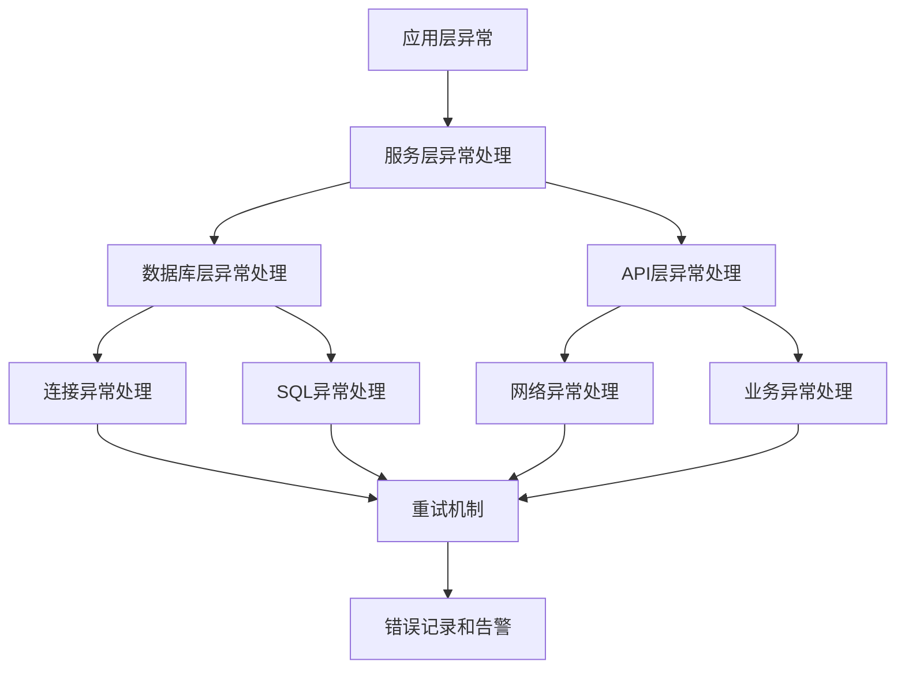

# 错误处理和重试机制文档

## 概述

本文档详细说明简道云数据同步程序中的错误处理策略和重试机制，包括异常分类、重试策略、错误恢复和监控告警。系统采用多层次的错误处理机制，确保数据同步的可靠性和稳定性。

## 错误处理架构

### 错误处理层次结构


### 核心组件
- **异常分类器**: 区分可重试和不可重试异常
- **重试调度器**: 管理重试逻辑和间隔
- **错误记录器**: 记录详细的错误信息
- **监控告警**: 实时监控和异常通知

## 异常分类体系

### 1. 数据库相关异常

#### 连接异常（可重试）
```java
// 数据库连接超时
SQLException: Connection timed out
SQLException: Connection refused
SQLException: Network error

// 处理策略：自动重试，最大重试次数10次
```

#### SQL执行异常（部分可重试）
```java
// 可重试的SQL异常
SQLException: Deadlock detected
SQLException: Lock timeout
SQLException: Temporary failure

// 不可重试的SQL异常
SQLException: Syntax error
SQLException: Table not found
SQLException: Permission denied
```

#### 连接池异常
```java
// 连接池耗尽（可重试）
SQLException: Connection pool exhausted
HikariPool: Connection is not available

// 处理策略：等待连接释放后重试
```

### 2. API调用异常

#### 网络异常（可重试）
```java
// 网络连接问题
IOException: Connection timeout
IOException: Read timeout
IOException: Connection reset

// HTTP状态码异常
HttpException: 429 Too Many Requests
HttpException: 502 Bad Gateway
HttpException: 503 Service Unavailable
```

#### 业务异常（部分可重试）
```java
// 可重试的业务异常
ApiException: Rate limit exceeded
ApiException: Server busy
ApiException: Temporary service unavailable

// 不可重试的业务异常
ApiException: Invalid API token
ApiException: Permission denied
ApiException: Invalid request format
```

### 3. 数据处理异常

#### 数据转换异常（不可重试）
```java
// 数据格式错误
DataTransformException: Invalid date format
DataTransformException: Number format error
DataTransformException: Field mapping error

// 处理策略：跳过异常记录，记录错误信息
```

#### 配置异常（不可重试）
```java
// 配置文件问题
ConfigException: Configuration file not found
ConfigException: Invalid configuration format
ConfigException: Missing required configuration

// 处理策略：程序启动失败，输出详细错误信息
```

## 重试机制设计

### 1. 重试配置参数

#### 全局重试配置
```java
public class Constants {
    public static final int MAX_RETRY = 10;           // 最大重试次数
    public static final long RETRY_INTERVAL = 5000;   // 重试间隔(毫秒)
    public static final int MAX_BATCH_SIZE = 50;      // 批处理大小
}
```

#### 不同场景的重试配置
| 异常类型 | 最大重试次数 | 重试间隔 | 重试策略 |
|----------|--------------|----------|----------|
| 数据库连接异常 | 10 | 5秒 | 固定间隔 |
| API调用异常 | 10 | 5秒 | 指数退避 |
| 网络超时异常 | 5 | 10秒 | 固定间隔 |
| 业务逻辑异常 | 3 | 2秒 | 固定间隔 |

### 2. 重试策略实现

#### 固定间隔重试
```java
public List<Map<String, Object>> fetchNewDataWithRetry(Integer lastSyncId, String fields) {
    int retryCount = 0;
    while (retryCount < Constants.MAX_RETRY) {
        try {
            return fetchNewData(lastSyncId, fields);
        } catch (SQLException e) {
            retryCount++;
            if (retryCount >= Constants.MAX_RETRY) {
                LogUtil.logError("查询数据失败，已重试" + Constants.MAX_RETRY + "次: " + e.getMessage());
                return new ArrayList<>();
            }
            
            LogUtil.logWarning("查询数据失败，准备第" + retryCount + "次重试...");
            try {
                Thread.sleep(Constants.RETRY_INTERVAL);
            } catch (InterruptedException ie) {
                Thread.currentThread().interrupt();
                break;
            }
        }
    }
    return new ArrayList<>();
}
```

#### 指数退避重试
```java
public boolean createDataWithExponentialBackoff(String appId, String entryId, 
                                               List<Map<String, Object>> dataList) {
    int retryCount = 0;
    long baseDelay = 1000; // 基础延迟1秒
    
    while (retryCount < Constants.MAX_RETRY) {
        try {
            return createData(appId, entryId, dataList, true);
        } catch (IOException e) {
            retryCount++;
            if (retryCount >= Constants.MAX_RETRY) {
                LogUtil.logError("API调用失败，已重试" + Constants.MAX_RETRY + "次: " + e.getMessage());
                return false;
            }
            
            // 指数退避：延迟时间 = 基础延迟 * 2^重试次数
            long delay = baseDelay * (1L << retryCount);
            LogUtil.logWarning("API调用失败，" + delay + "毫秒后进行第" + retryCount + "次重试...");
            
            try {
                Thread.sleep(delay);
            } catch (InterruptedException ie) {
                Thread.currentThread().interrupt();
                break;
            }
        }
    }
    return false;
}
```

### 3. 智能重试判断

#### 异常分类器
```java
public class ExceptionClassifier {
    
    /**
     * 判断异常是否可重试
     */
    public static boolean isRetryableException(Exception e) {
        // 数据库连接异常 - 可重试
        if (e instanceof SQLException) {
            String message = e.getMessage().toLowerCase();
            return message.contains("timeout") || 
                   message.contains("connection") ||
                   message.contains("deadlock") ||
                   message.contains("lock timeout");
        }
        
        // 网络异常 - 可重试
        if (e instanceof IOException) {
            String message = e.getMessage().toLowerCase();
            return message.contains("timeout") ||
                   message.contains("connection reset") ||
                   message.contains("connection refused");
        }
        
        // HTTP异常 - 部分可重试
        if (e instanceof HttpException) {
            int statusCode = ((HttpException) e).getStatusCode();
            return statusCode == 429 ||  // Too Many Requests
                   statusCode == 502 ||  // Bad Gateway
                   statusCode == 503 ||  // Service Unavailable
                   statusCode == 504;    // Gateway Timeout
        }
        
        // 其他异常默认不重试
        return false;
    }
    
    /**
     * 获取建议的重试间隔
     */
    public static long getRetryInterval(Exception e, int retryCount) {
        if (e instanceof SQLException) {
            return Constants.RETRY_INTERVAL; // 固定5秒
        } else if (e instanceof IOException) {
            // 指数退避
            return 1000L * (1L << Math.min(retryCount, 6)); // 最大64秒
        } else {
            return Constants.RETRY_INTERVAL;
        }
    }
}
```

## 错误恢复策略

### 1. 数据库错误恢复

#### 连接池恢复
```java
public class DatabaseConnectionPool {
    
    /**
     * 连接池健康检查和恢复
     */
    public static void healthCheck() {
        try {
            // 测试连接可用性
            Connection testConn = getConnection();
            testConn.createStatement().execute("SELECT 1");
            returnConnection(testConn);
            
            LogUtil.logInfo("数据库连接池健康检查通过");
        } catch (SQLException e) {
            LogUtil.logError("数据库连接池异常，尝试重新初始化: " + e.getMessage());
            
            // 重新初始化连接池
            try {
                reinitializePool();
                LogUtil.logInfo("数据库连接池重新初始化成功");
            } catch (Exception re) {
                LogUtil.logError("数据库连接池重新初始化失败: " + re.getMessage());
            }
        }
    }
    
    private static void reinitializePool() throws SQLException {
        // 关闭现有连接池
        if (dataSource != null) {
            dataSource.close();
        }
        
        // 重新创建连接池
        initializePool();
    }
}
```

#### 事务回滚机制
```java
public void updateSyncStatusWithTransaction(int lastSyncId, LocalDate syncDate, int syncCount) {
    Connection conn = null;
    try {
        conn = DatabaseConnectionPool.getConnection();
        conn.setAutoCommit(false); // 开启事务
        
        // 执行更新操作
        updateSyncStatus(conn, lastSyncId, syncDate, syncCount);
        
        conn.commit(); // 提交事务
        LogUtil.logInfo("同步状态更新成功");
        
    } catch (SQLException e) {
        LogUtil.logError("更新同步状态失败: " + e.getMessage());
        
        // 回滚事务
        if (conn != null) {
            try {
                conn.rollback();
                LogUtil.logInfo("事务已回滚");
            } catch (SQLException re) {
                LogUtil.logError("事务回滚失败: " + re.getMessage());
            }
        }
        
        throw new RuntimeException("同步状态更新失败", e);
    } finally {
        if (conn != null) {
            try {
                conn.setAutoCommit(true); // 恢复自动提交
                DatabaseConnectionPool.returnConnection(conn);
            } catch (SQLException e) {
                LogUtil.logError("恢复连接状态失败: " + e.getMessage());
            }
        }
    }
}
```

### 2. API错误恢复

#### 令牌刷新机制
```java
public class ApiTokenManager {
    private static String currentToken;
    private static long tokenExpireTime;
    
    /**
     * 获取有效的API令牌
     */
    public static String getValidToken() {
        if (isTokenExpired()) {
            refreshToken();
        }
        return currentToken;
    }
    
    /**
     * 刷新API令牌
     */
    private static void refreshToken() {
        try {
            // 调用令牌刷新API
            String newToken = callRefreshTokenApi();
            currentToken = newToken;
            tokenExpireTime = System.currentTimeMillis() + 3600000; // 1小时后过期
            
            LogUtil.logInfo("API令牌刷新成功");
        } catch (Exception e) {
            LogUtil.logError("API令牌刷新失败: " + e.getMessage());
            throw new RuntimeException("无法获取有效的API令牌", e);
        }
    }
}
```

#### 请求降级机制
```java
public class ApiService {
    
    /**
     * 带降级的API调用
     */
    public boolean createDataWithFallback(String appId, String entryId, 
                                         List<Map<String, Object>> dataList) {
        try {
            // 尝试批量创建
            return createData(appId, entryId, dataList, true);
        } catch (Exception e) {
            LogUtil.logWarning("批量创建失败，尝试单条创建: " + e.getMessage());
            
            // 降级为单条创建
            return createDataOneByOne(appId, entryId, dataList);
        }
    }
    
    /**
     * 单条创建（降级方案）
     */
    private boolean createDataOneByOne(String appId, String entryId, 
                                      List<Map<String, Object>> dataList) {
        int successCount = 0;
        for (Map<String, Object> data : dataList) {
            try {
                List<Map<String, Object>> singleList = Arrays.asList(data);
                if (createData(appId, entryId, singleList, true)) {
                    successCount++;
                }
            } catch (Exception e) {
                LogUtil.logError("单条数据创建失败: " + e.getMessage());
            }
        }
        
        LogUtil.logInfo("单条创建完成，成功: " + successCount + "/" + dataList.size());
        return successCount > 0;
    }
}
```

### 3. 数据一致性保证

#### 同步状态检查点
```java
public class SyncCheckpoint {
    
    /**
     * 创建检查点
     */
    public static void createCheckpoint(int syncId, String operation) {
        try {
            String sql = "INSERT INTO sync_checkpoint (sync_id, operation, create_time, status) VALUES (?, ?, ?, ?)";
            // 执行插入操作
            LogUtil.logInfo("创建同步检查点: " + syncId + " - " + operation);
        } catch (SQLException e) {
            LogUtil.logError("创建检查点失败: " + e.getMessage());
        }
    }
    
    /**
     * 检查未完成的同步
     */
    public static List<Integer> getIncompleteSync() {
        List<Integer> incompleteIds = new ArrayList<>();
        try {
            String sql = "SELECT sync_id FROM sync_checkpoint WHERE status = 'PROCESSING'";
            // 执行查询操作
            LogUtil.logInfo("发现未完成的同步: " + incompleteIds.size() + " 条");
        } catch (SQLException e) {
            LogUtil.logError("检查未完成同步失败: " + e.getMessage());
        }
        return incompleteIds;
    }
}
```

## 错误监控和告警

### 1. 错误统计

#### 错误计数器
```java
public class ErrorCounter {
    private static final Map<String, AtomicInteger> errorCounts = new ConcurrentHashMap<>();
    private static final Map<String, Long> lastErrorTime = new ConcurrentHashMap<>();
    
    /**
     * 记录错误
     */
    public static void recordError(String errorType) {
        errorCounts.computeIfAbsent(errorType, k -> new AtomicInteger(0)).incrementAndGet();
        lastErrorTime.put(errorType, System.currentTimeMillis());
        
        // 检查是否需要告警
        checkAlarmThreshold(errorType);
    }
    
    /**
     * 检查告警阈值
     */
    private static void checkAlarmThreshold(String errorType) {
        int count = errorCounts.get(errorType).get();
        long timeWindow = 300000; // 5分钟时间窗口
        
        if (count >= 10) { // 5分钟内错误超过10次
            long lastTime = lastErrorTime.get(errorType);
            if (System.currentTimeMillis() - lastTime < timeWindow) {
                sendAlarm(errorType, count);
            }
        }
    }
    
    /**
     * 发送告警
     */
    private static void sendAlarm(String errorType, int count) {
        String message = String.format("错误类型: %s, 错误次数: %d, 时间: %s", 
                                     errorType, count, new Date());
        LogUtil.logError("触发告警: " + message);
        
        // 这里可以集成邮件、短信或其他告警系统
        // AlarmService.sendAlarm(message);
    }
}
```

### 2. 健康检查

#### 系统健康监控
```java
public class HealthMonitor {
    
    /**
     * 执行健康检查
     */
    public static HealthStatus performHealthCheck() {
        HealthStatus status = new HealthStatus();
        
        // 检查数据库连接
        status.setDatabaseHealth(checkDatabaseHealth());
        
        // 检查API连接
        status.setApiHealth(checkApiHealth());
        
        // 检查内存使用
        status.setMemoryHealth(checkMemoryHealth());
        
        // 检查同步状态
        status.setSyncHealth(checkSyncHealth());
        
        return status;
    }
    
    private static boolean checkDatabaseHealth() {
        try {
            Connection conn = DatabaseConnectionPool.getConnection();
            conn.createStatement().execute("SELECT 1");
            DatabaseConnectionPool.returnConnection(conn);
            return true;
        } catch (Exception e) {
            LogUtil.logError("数据库健康检查失败: " + e.getMessage());
            return false;
        }
    }
    
    private static boolean checkApiHealth() {
        try {
            // 发送简单的API测试请求
            // 这里可以调用一个轻量级的API接口
            return true;
        } catch (Exception e) {
            LogUtil.logError("API健康检查失败: " + e.getMessage());
            return false;
        }
    }
}
```

### 3. 日志管理

#### 结构化错误日志
```java
public class ErrorLogger {
    
    /**
     * 记录结构化错误信息
     */
    public static void logStructuredError(String operation, Exception e, 
                                        Map<String, Object> context) {
        Map<String, Object> errorInfo = new HashMap<>();
        errorInfo.put("timestamp", System.currentTimeMillis());
        errorInfo.put("operation", operation);
        errorInfo.put("errorType", e.getClass().getSimpleName());
        errorInfo.put("errorMessage", e.getMessage());
        errorInfo.put("stackTrace", getStackTrace(e));
        errorInfo.put("context", context);
        
        // 转换为JSON格式记录
        String jsonLog = convertToJson(errorInfo);
        LogUtil.logError(jsonLog);
        
        // 同时记录到错误统计
        ErrorCounter.recordError(e.getClass().getSimpleName());
    }
    
    private static String getStackTrace(Exception e) {
        StringWriter sw = new StringWriter();
        PrintWriter pw = new PrintWriter(sw);
        e.printStackTrace(pw);
        return sw.toString();
    }
}
```

## 配置管理

### 错误处理配置
```properties
# 重试配置
retry.maxAttempts=10
retry.baseDelay=5000
retry.maxDelay=60000
retry.backoffMultiplier=2.0

# 告警配置
alarm.errorThreshold=10
alarm.timeWindow=300000
alarm.enabled=true

# 健康检查配置
health.checkInterval=60000
health.databaseTimeout=5000
health.apiTimeout=10000
```

## 最佳实践

### 1. 异常处理原则
- **快速失败**: 对于不可恢复的异常，立即失败并记录详细信息
- **优雅降级**: 在部分功能异常时，保证核心功能正常运行
- **资源清理**: 确保异常情况下资源得到正确释放

### 2. 重试策略选择
- **幂等操作**: 可以安全重试的操作使用较多重试次数
- **非幂等操作**: 谨慎重试，避免重复执行
- **时间敏感操作**: 使用较短的重试间隔

### 3. 监控告警设计
- **分级告警**: 根据错误严重程度设置不同的告警级别
- **告警抑制**: 避免相同错误的重复告警
- **自动恢复**: 在可能的情况下实现自动错误恢复

通过本文档，开发人员可以全面了解错误处理和重试机制的设计思路，确保系统的高可用性和稳定性。